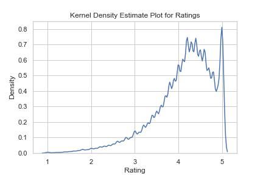
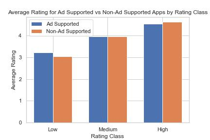
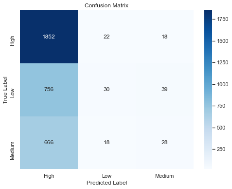

# Google Play Store App Rating Models & Predictions 


**Authors and Contact Information:** 
- [Goknur Kaya](https://github.com/GoknurK) - 
- [Linkedin](https://www.linkedin.com/in/goknurk/) (Email: goknurkaya@gmail.com)

Jan 4, 2024

## Overview
This project addresses the development of a new app owned and managed by a big multinational corporation. The project is sponsored by the Business Intelligence & Data Science (BIDS) division of the company. As a new app that has received significant investment, senior management is particularly interested in the relationship between user ratings and intrinsics such as pricing, downloads, etc. The development team is slated to work in close collaboration with the data team to drive development towards a successful end product which combines key app rating factors with current in-house development standards and beliefs.


## Business Problem

Google is one of the most impactful tech companies today. Google Play Store, the Android platform's dedicated marketplace for digital app purchases, originally launched in 2008. As of the first quarter of 2021, Google Play Store accounted for 3.5 million apps. Among these apps, in-store user ratings are thought to be the most decisive factors before downloading a given app. We, as a large worldwide firm, are interested in both categorical and numerical impacts of features on high user ratings in order to steer in-house development. For that, a thorough  analysis of present app ratings is key. Apart from finding meaningful features and their impact on high user ratings,  a suitable predictive model is also sought to determine  ratings within a rating range of Low, Medium and High.

## Data Understanding and Analysis


- The dataset is sourced from Kaggle, specifically the [Google Play Store Dataset](https://www.kaggle.com/datasets/gauthamp10/google-playstore-apps/data), comprising 24 columns including category, rating, installs, content rating, ad supported, editors' choice, etc. The data spans from 2010 to 2021, with the original dataset exceeding 3 million entries.


- In the data cleaning process, we excluded ratings of 0, as they indicate apps not rated by anyone. Due to computational limitations, our modeling efforts focused on a subset of 15,000 data points. Additionally, a rating class column was engineered, categorizing ratings into 'Low,' 'Medium,' and 'High' based on their distribution: 

     - `Low Rating` 1-3.8 
     - `Medium Rating` 3.8 -4.2
     - `High Rating` 4.2-5

- Several limitations were encountered, including the absence of app prices, in-game ad display durations, lack of in-app purchase figures, and imbalanced ratings.



The kernel density plot indicates that a significant portion of Google Play Store ratings tends to be on the higher side.


Examining the total installs across categories, tools, action, casual, and arcade emerge as the most installed categories, respectively.




In the analysis of ad-supported versus non-ad-supported apps, the graph illustrates minimal differences in high ratings. Surprisingly, low-rated apps with ads receive higher ratings, while medium-rated apps show similar ratings, suggesting that incorporating ads may not significantly impact the overall app rating.

## Modeling

We implemented five models—KNN, XGBoost (XGBC), Support Vector Machine (SVM), and Logistic Regression. Out of these, XGBoost emerged as the top performer with an accuracy score of 56% and an impressive recall rating of 98%. Upon analyzing feature importance, we discovered that app name, category, installs, and ad supported were the most influential factors on ratings. Other features did not exhibit a strong impact. The presented confusion matrix for the XGBoost Classifier reveals a noteworthy trend: our model largely predicted high ratings, underscoring the limited occurrence of medium and low ratings within the dataset.



## Recommendations

- **Ad Supported**: Emphasize the impact of Ad Supported status, to strategically place advertisements within high-performing apps and maximize ad revenue on the Google Play Store.

- **Installs**: Drive Installations through Strategic Promotions, Focus on promotions that drive app installations, utilizing channels and tactics that resonate with the target audience.

- **Category**: Target Audience-Centric Marketing
Tailor marketing efforts to the specific category, understanding the preferences of users within that segment for more effective promotional strategies.

- **App Name**: Ensure the app name is both search-friendly and memorable, helping users find it easily and creating a lasting impression.


## Future Insights

- **App Prices**

Analyze how different pricing tiers may impact user acquisition and overall revenue. Explore trends such as freemium models, where the app is free but offers in-app purchases.

- **In-App Purchases**

Consider how the availability of in-app purchases influences user engagement and monetization. Assess whether certain categories are more conducive to in-app transactions.

- **User Behavior and Spending Patterns**

Analyze user preferences for specific categories and pricing models. 

## Additional Resources

- [App Reviews and Ratings](https://appradar.com/academy/app-reviews-and-ratings/google-play-ratings-and-reviews)

- [Google Play Store Statistics](https://appinventiv.com/blog/google-play-store-statistics/)

- [Google Play Store Background](https://en.wikipedia.org/wiki/Google_Play#:~:text=Google%20Play%20was%20launched%20on,for%20each%20of%20the%20services.)

## For More Information 

Please visit our full analysis in our [Jupyter Notebook](Google_Play_Store_App_Rating_Models_Predictions.ipynb), [Slide Presentation](Google_Play_Store_App_Rating_Models_Predictions.pdf) and watch my [Live Project Presentation](https://youtu.be/zHmiaOL8Hqo?list=PLc6AmvC5ZybwRhxr-2q5XSvmw-7fcEAky&t=1537).

## Repository Structure

You are in the README.md. 'Google_Play_Store_App_Rating_Models_Predictions.ipynb' contains the jupyter notebook that explains our data science steps for you to replicate. 'google_playstore_app_rating_prediction_presentation.pdf' contains our presentation slides that sums up important information for our audience. In 'Data' you will be able to see the datasets we worked with. Likewise, 'image' will contain images used.

```bash

├── data                                                       <- Folder consisting dataset used in this project

├── image                                                      <- Folder consisting images used in this project

├── .gitignore                                                 <- Contains list of files ignored from GitHub

├── google_playstore_app_rating_prediction_presentation.pdf    <- Slide Presentation of the project

├── README.md                                                  <- Contains README file consisting summary of the project
